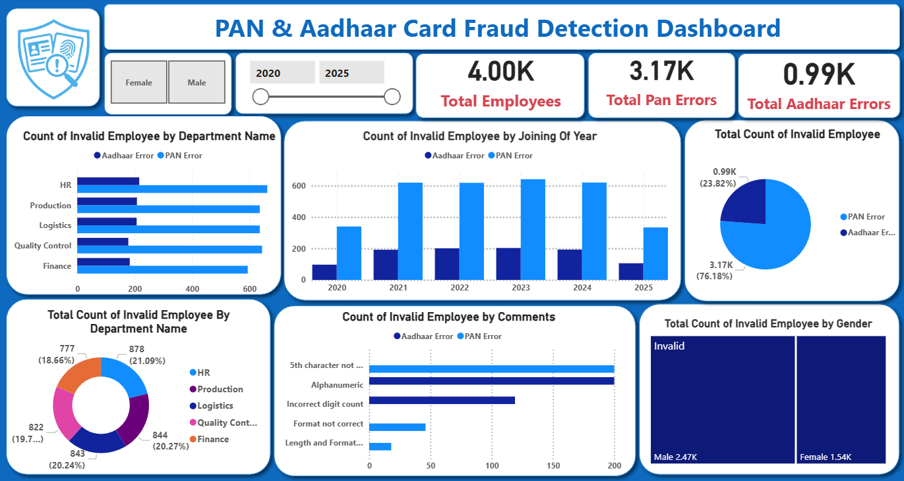

# PAN and Aadhaar Card Fraud Detection Analysis

## Overview

The **PAN and Aadhaar Card Fraud Detection Analysis** is a data analytics project built using **Excel**, **MySQL**, and **Power BI**. It aims to detect anomalies and fraudulent entries in employee identity records and attendance logs.

---

### Key Features:

- **End-to-End Data Pipeline**: From Excel preprocessing → MySQL logic → Power BI dashboard.
- **PAN/Aadhaar Validation**: Checks document format and content consistency using SQL rules.
- **Attendance Fraud Checks**: Detects duplicate swipes and missing entries.
- **Power BI Dashboard**: Visualizes fraud trends, invalid records, and department-wise anomalies.
- **Interactive Filters**: Slice data by department, location, and date range for detailed analysis.

---

## Features:

- ✅ **Clean and Prepare Data**: Remove blanks, fill missing exit dates, and standardize formats using Excel.
- ✅ **Validate Identity Documents**:
  - PAN: Check for format, length, and 5th-character logic.
  - Aadhaar: Validate 12-digit rule and disallow alphabets.
- ✅ **Detect Fraud Patterns**:
  - Duplicate Employee IDs
  - Invalid PAN or Aadhaar entries
  - Attendance entries with suspicious check-in/check-out logs
- ✅ **Interactive Dashboard**:
  - Department-wise fraud stats
  - KPI cards (Invalid PAN, Suspicious Aadhaar, Fraud %)
  - Drill-down on employee records
  - Time-based filtering with slicers

---

## Tech Stack:

- **Excel**:
  - Data cleaning and formatting
  - Handling NULL or duplicate entries

- **MySQL**:
  - SQL queries for validation, joining tables, fraud detection logic
  - PAN and Aadhaar checks using REGEXP and CASE conditions

- **Power BI**:
  - Dashboard development and visual representation of fraud
  - Use of DAX to create KPIs and calculated metrics

- **DAX Measures**:
  -  `Total Number of Employee`
  - `Total Invalid PAN`
  - `Total Invalid Aadhaar`
  - `Suspicious Aadhaar Count`
  - `Fraud % by Department`
  - `Duplicate Swipe Count`
  - `Missing Swipe Tracker`

---

## PAN and Aadhaar Validation Rules

### ✅ PAN Card Format

- Format: `AAAAA9999A` (10-character alphanumeric)
- Rules:
  - First 5: Letters `[A-Z]`
  - Next 4: Digits `[0-9]`
  - Last character: Letter `[A-Z]`
  - 5th character should match:
    - First letter of surname (or first name if surname is missing)

📌 Examples:
- `ABCDE1234M` – Valid for **Koushik Mehta**
- `ABCDK1234P` – Valid if only first name is available

---

### ✅ Aadhaar Card Format

- Format: 12-digit numeric code
- Rules:
  - Must be 12 digits
  - Cannot start with `0` or `1`
  - No alphabets or special characters
  - Must pass **Verhoeff algorithm** (used by UIDAI)

📌 Examples:
- ✅ `2345 6789 1234` → Valid
- ❌ `0123 4567 8901` → Starts with 0
- ❌ `1234-5678-9012` → Contains symbols

---

## 📊 Power BI Dashboard Overview

The final Power BI dashboard provides a detailed and interactive visualization of PAN and Aadhaar card fraud detection across departments, years, and genders.

---

### 🖼️ Dashboard Preview

---

### 🔍 Key Dashboard Highlights

#### ✅ Top-Level KPIs (Cards)
- **Total Employees**: `4.00K`
- **Total PAN Errors**: `3.17K`
- **Total Aadhaar Errors**: `0.99K`

#### ✅ Filters
- **Gender Filter**: Toggle between male/female employees
- **Time Range Slider**: View fraud trend from 2020 to 2025

---

### 📈 Visual Breakdown

| Visualization | Description |
|---------------|-------------|
| **Count of Invalid Employee by Department Name** | Shows number of Aadhaar & PAN errors across departments (HR, Production, Logistics, etc.) |
| **Count of Invalid Employee by Joining Year** | Displays how PAN/Aadhaar errors are distributed from 2020–2025 |
| **Invalid Employee Breakdown (Pie Chart)** | Visualizes total PAN vs Aadhaar errors as a % share |
| **Invalid Count by Department (Donut Chart)** | Department-wise share of total fraud cases |
| **Invalid Comments Analysis** | Categorizes the type of error (e.g. `5th character not matching`, `alphanumeric Aadhaar`, `incorrect digit count`, etc.) |
| **Invalid Employees by Gender (TreeMap)** | Gender-wise distribution of invalid employees (e.g. 2.47K Male, 1.54K Female) |

---

### 📁 How to Use

1. Load the cleaned `.csv` employee dataset into **MySQL**
2. Run validation SQL queries to detect PAN/Aadhaar fraud
3. Connect the MySQL database to **Power BI**
4. Build visualizations and slicers using **DAX** measures:
   - `Total Invalid PAN`
   - `Suspicious Aadhaar Count`
   - `Invalid by Department`, `Year`, `Gender`
   - `Fraud by Comments`

---

### 🔽 Download Dashboard

📂 **[Download Power BI File](C:\Users\ravi\OneDrive\Pictures\Screenshots\dashboard.png)**  
> Open with Power BI Desktop to view full slicers, visuals, and interactivity.

